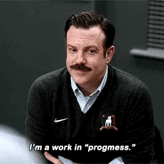

# How does Brian even

Welcome to my README! In the age of remote work, it can be harder than ever to get to know the people you work with (especially a new manager!), so I wrote this README in hopes to help you understand how best to work with me. I care deeply about the work I do and the people on my team and I want to help you be your best self and do your best work.

> [!NOTE]
> **Special thank you** to [Danielle Leong](https://github.com/dmleong) for graciously allowing me to steal/fork her idea (and content) for this repository

## TLDR
I believe in putting people first. I believe in collaborative teams without bullies. I believe in progress over perfection. I value getting it right over being right. I will advocate for you both professionally and personally. I believe discomfort leads to growth. I value transparency, authenticity and vulnerability. I value the safety of the marginalized over the hurt feelings of the privileged. I am an extrovert. I recommend watching [Ted Lasso](https://en.wikipedia.org/wiki/Ted_Lasso) and [The Call to Courage](https://youtu.be/gr-WvA7uFDQ?si=W6u6TuN3oAuvRpyI) to understand my motivations for leading a team and my philosophy around the importance of authenticity and vulnerability.

## Table of contents
- [About](docs/about.md)
  - [My philosophy](docs/about.md#my-philosophy)
  - [My role](docs/about.md#my-role) (momma bear coaching soccer.gif)
  - [Values](docs/about.md#values)
- [Expectations](docs/expectations.md#expectations) 
  - [High performers](docs/expectations.md#high-performers)
  - [Managing managers](docs/expectations.md#managers)
  - [How I will provide feedback to you](docs/expectations.md#how-i-will-provide-feedback-to-you)
- [Housekeeping](docs/housekeeping.md)
  - [Feedback for me](docs/housekeeping.md#feedback-for-me)
  - [Availability](docs/housekeeping.md#availability)
  - [Expenses and Requests](docs/housekeeping.md#expenses-and-requests)
- [Meetings](docs/meetings.md)
  - [1:1s](docs/meetings.md#11s)
  - [Retrospectives](docs/meetings.md#retrospectives)
- [Things I'm working on](docs/about.md#things-im-working-on)
- [Recommended readings](recommended-readings.md)

## Conclusion

Thank you for slogging through my very "work in progmess" README. Hopefully this helps you understand how to work better with me. Please feel free to open a PR with any suggestions!

