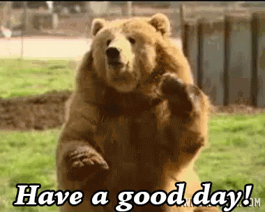

# About me
I guess this is why you're here?

## My philosophy

I often ask people "What is your purpose in life?" I think it's a very telling question and I hope a thought-provoking one! For me, the answer has been pretty consistent for the past few years: **My purpose in life is to help people become the best they can be.**

[Radical Candor](https://www.blinkist.com/en/books/radical-candor-en/) is perhaps the best resource to understand my approach to management and feedback. I believe in giving timely, honest feedback _because I care about you._ I don't believe in surprising people at review time with bad feedback. Your performance reviews should be underwhelming events because you should always know where you stand with me at all times. You can read more about my thoughts on feedback [here](https://medium.com/@tsunamino/setting-goals-with-your-engineers-that-dont-completely-suck-cb76b87e4275).

## My role

I like to think of myself as a momma bear coaching a soccer team that my cubs are on. I will 100% eat any other bears that dares to hurt my team, but I also expect my cubsters to be on their best behavior and to be excellent team players. Everyone must shake hands (or paws, if you must) with the other team at the end of the game. No exceptions.

In real people terms, it means I expect my reports to be collaborative team players and to be good sports if something does go wrong. There is no room for ego on my team. **There is no room for bullies on this team.** If someone is doing really well on the team, we should all celebrate that person's work! If you're doing really well, we will also celebrate you! If you need to constantly be in the limelight **at the expense of others**, then you may want to reconsider if this is the best fit for you.

I also identify pretty strongly with Jessica from [Fresh Off the Boat](https://en.wikipedia.org/wiki/Fresh_Off_the_Boat) (in the first 4 seasons at least). I'll push you to do your absolute best, but it's only because I care about your future!

My role as the EM on this team is to:

- trust you to do your job
- unblock you
- provide you with a safe environment to grow into a well-rounded human
- give you timely feedback, both good and constructive
- get you the resources you need
- challenge you in ways that will help you grow
- champion your accomplishments to anyone who will listen (and even those who won't)

My role is not to:

- do your job for you
- enable destructive behaviors

You do have to meet me halfway. I will be your biggest cheerleader, but I can't be everywhere at once! Sometimes I'll ask you to write down what you're doing to help me out. Sometimes it's because I legit have too many things to focus on and I need an easy way to recall all the amazing things that you've done lately. Help me help you get more money!

## What do I value most?

I value honesty over saving face.

I value genuine efforts to improve over using the "correct" words all the time.

I value the safety of the marginalized over the hurt feelings of the privileged.

I value context and transparency.

I value consent and boundaries.

I value collaboration and clear communication over ego (including my own).

I value sustainable work/life equilibrium.

I value shipping iteratively and quickly.

I value learning from mistakes over blaming others.

I value emotional labor.

I value getting things done.

I value having fun! We do serious things, but we don't necessarily have to be serious all the time.

I understand that it can be difficult to trust a new manager. You've probably been burned before! But hopefully laying out my values can help you understand where I'm coming from. I will always tell you as much information as I know and am able to tell you and work with you to understand the context behind decisions. I will always care about you as a person and your wellbeing. My values are the most important thing to me.

## Things I'm working on

As much as I like to think I'm a robot who will live forever without feelings, I often fail pretty hard. Some known failure modes I have are:

- overcommitting to events and burning out
- getting overwhelmed at social events (I am an introvert after all)
- forgetting to do self-care
- not liking being told what to do (asking questions has a much better success rate)

Ways I'm working on these:
- regularly going to therapy
- regularly going to the gym
- actively working on [closing the stress cycle](https://www.amazon.com/Burnout-Secret-Unlocking-Stress-Cycle-ebook/dp/B07DT4GW16/ref=tmm_kin_swatch_0?_encoding=UTF8&qid=1567181581&sr=8-1)
- [photography](https://instagram.com/danielleleongphoto)
- limiting the number of extracurricular activities I do
- regularly taking time off
- limiting social media usage

Ways you can help!
- remind me to take breaks (I always appreciate this)
- remind me to delegate
- give me some space if it looks like it's That Kind of Day
- snacks. Snacks are always appreciated (savory preferred). Or coffee/tea.
- start with questions and context - I always value learning about your understanding of a situation so that we can be on the same page
